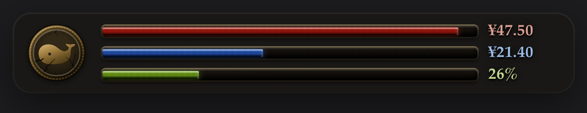

# BuilderHUD

Customizable vitals-cluster skins for the DSH sidebar. It ships one:
**Souls Style** — three Dark Souls style bars beside an engraved covenant medallion
whose shape, device, metal and light/dark cut are all settings, and whose edge
doubles as a token-burn gauge.



| Bar | Meaning | Colour |
| --- | --- | --- |
| **HP** | API balance — the account's recharge wallet | crimson |
| **FP** | gift/bonus wallet balance, on the same ¥ scale | deep blue |
| **Stamina** | the context window **still available** to the session on screen | yellow-green |

The medallion is flat SVG built at runtime: every device is cast from the same
metal as the rim, in both the light and the dark cut, and a device can be an SVG
you upload. The ring around it is a live token-burn gauge, coloured by whether the
current hour is inside DeepSeek's off-peak window — including Chinese public
holidays and 调休 make-up workdays.

## What is in here

| Path | What it is |
| --- | --- |
| [`plugins/builder-hud`](plugins/builder-hud) | the **bundle**: the card the Plugins page lists, and the patch layer that puts a row on it |
| [`plugins/souls-hud`](plugins/souls-hud) | the **skin**: host half (state, settings, the donation route), client half (the settings form), and the renderer (`hud.js` + `hud.css`) |

There is no runtime code in the bundle on purpose, and the reason is load-bearing:
the name on the card comes from the package listed in `dsh.profile.bundles`, the
name on the row comes from the package the row points at — so two names need two
packages. [The Souls Style README](plugins/souls-hud/README.md) is the real
documentation: installation, every setting, the artwork, the tariff rule, the
holiday calendar and the test suite. Start there.

## Install

From a checkout, point one row at the skin's host entry in your profile's
`cordis.patch.yml`:

```yaml
- insert:
    - id: souls-hud
      name: "/absolute/path/to/plugins/souls-hud/lib/host.js"
      config:
        hpTargetCny: 100
        fpTargetCny: 50
        shape: round
        device: whale
        material: bronze
```

Full instructions — including the two-package layout and why the row must not be
repeated in the profile layer — are in
[the Souls Style README](plugins/souls-hud/README.md#installation).

## Verifying

```sh
node plugins/souls-hud/test/harness.mjs          # offline: fakes the Cordis context + services
node plugins/souls-hud/test/form.mjs             # renders the settings page in Node
node plugins/souls-hud/test/upload.mjs           # the upload path, in headless Chrome
node plugins/souls-hud/test/preview.mjs          # rebuilds preview/preview.html
node plugins/builder-hud/test/icon.mjs --check   # the card artwork matches the renderer
node plugins/builder-hud/test/icon.mjs --shape octagon --device sun \
  --out plugins/souls-hud/icon.svg --check         # the skin's row icon
node test/repo.mjs                               # the .github files, and every link in the docs
```

`harness.mjs` drives the routes through a copy of the real request matcher, the
settings form is mounted three times (shipped, configured, empty), and the upload
path is exercised against hostile SVGs. `repo.mjs` guards the repository's own
metadata: the issue forms, the sponsor button, and every link, anchor and command
the documents hand a reader. No dependencies — plain Node and, for the
browser-side tests, a local Chrome.

## Support

The plugin is free: no paid edition, no licence key, and nothing to unlock.

If it earns its place in your sidebar, the tip jar is **in the app**, on
BuilderHUD's card page — a WeChat 赞赏码 for readers in China, and
**[Ko-fi](https://ko-fi.com/tonyhd)** everywhere else. It buys nothing; the licence
is MIT either way.

## Unaffiliated

This is an independent, third-party plugin. It is **not** affiliated with,
endorsed by, or supported by DeepSeek, and it ships none of their artwork: the
medallion, its devices and the whale are this project's own drawings.

"Dark Souls" is a trademark of FromSoftware, Inc. and Bandai Namco Entertainment
Inc.; it is used here **descriptively**, to say what the drawing looks like, the
way a font says "Gothic". This project is not affiliated with, endorsed by, or
supported by FromSoftware or Bandai Namco, ships none of their artwork or data,
and is not a product of theirs. The covenant-medal style is homage, not a claim.

## License

MIT — see [LICENSE](LICENSE).
