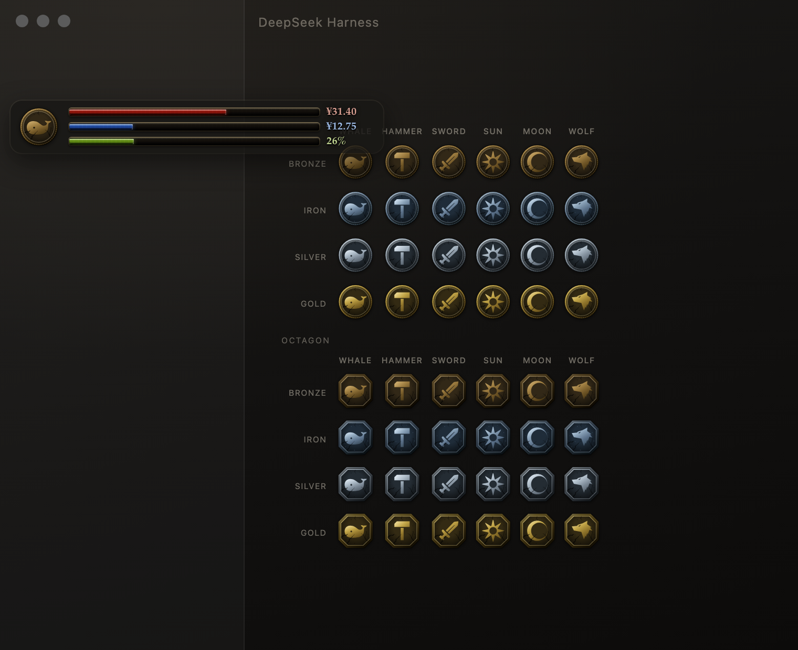
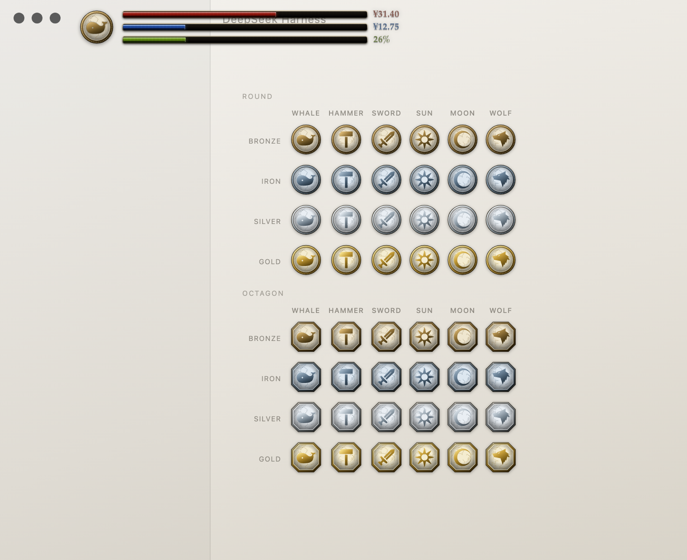
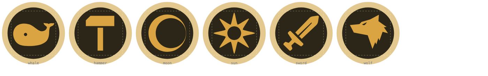
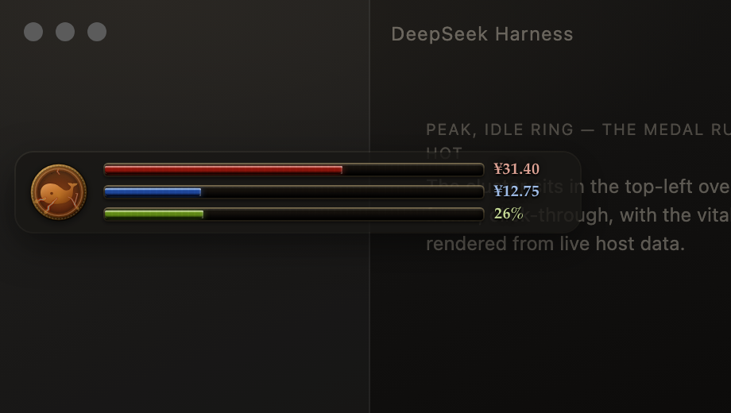
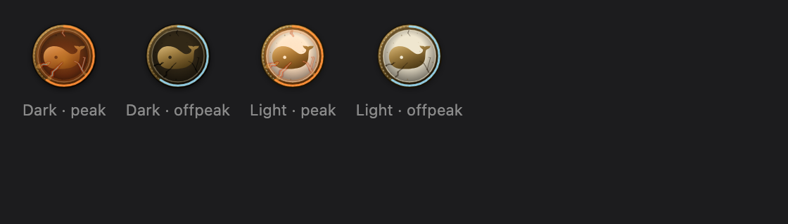

# Souls Style

A Dark Souls III style **covenant-medal** vitals cluster that replaces the DSH
sidebar's brand row. It is the component this package provides; the
[BuilderHUD bundle](../builder-hud) is what puts it on the Plugins page.

| Bar | Meaning | Colour |
| --- | --- | --- |
| **HP** | API balance — the account's recharge wallet | crimson |
| **FP** | gift/bonus wallet balance, on the same ¥ scale | deep blue |
| **Stamina** | the context window **still available** to the session on screen | yellow-green |

When a bar has nothing to show it says so with a bare dash — the stamina bar shows
`–` and *no* text, because the row is narrow and the reason is the host's business,
not the badge's.

Beside the bars sits an engraved medallion — a Dark Souls III style **covenant
medal**: a metal plate with a milled edge, a recessed field, and the covenant's
symbol struck into it in the same metal. Its **shape**, its **device** (the
figure in the field), its **metal** and that metal's light/dark cuts are all
settings — and a device can be an SVG you upload.

The badge style follows Dark Souls III's covenant emblems
([reference](https://darksouls.fandom.com/wiki/Covenants_(Dark_Souls_III))):
metal medal, recessed field, symbol stamped in metal.

**The material decides everything but the figure.** An earlier cut tinted the
recessed field per motif — the covenants' colour-coding, amber sun / blue moon /
green wolf — and it looked right until it was used: choosing a
*figure* silently repainted the badge's *background*, which is the metal's job.
So the device now decides the figure and nothing else, and `test/harness.mjs`
asserts that no `[data-device=…]` rule paints a field. If the enamel returns it
returns as its own setting, never as a side effect of picking a motif.




## The names, and why there are two packages

| Thing | Name | Package |
| --- | --- | --- |
| The bundle (the card in the Plugins page) | **BuilderHUD** | [`dsh-plugin-builder-hud`](../builder-hud) |
| The component (the row with the settings, and everything in this directory) | **Souls Style** | `dsh-plugin-souls-hud` |

> **The package name still says `souls-hud`; the display name says Souls Style.** That
> is deliberate. The package name, the row id, the route prefix, the settings file
> (`~/.dsh/souls-hud.json`) and the config keys are what an *installed* instance is
> addressed by, so renaming them would move every existing install's settings out from
> under it — for a name only a reader sees. The display name comes from
> `locale/*.json`, which is why the two no longer match: what people read changed,
> what the app resolves did not.

The card's title comes from the package named in `dsh.profile.bundles`; the
row's comes from the package the row's `name:` points at. Two titles therefore
need two packages, and the split is **not** cosmetic — a row has to name a real
package:

- `dsh-client-modules` discovers a browser half only for an **exact** package
  specifier (`exactPackageSpecifier` rejects anything containing `/`). A row
  addressed as a subpath — `dsh-plugin-builder-hud/souls-hud` — keeps its host
  half but **silently loses its client half**: no settings form on the row, and
  no renderer on the page at all, because this app never picks up the injected
  `<script>` and mounts the HUD through that client half.

So: the bundle carries the card copy (`locale/*.json`), the patch row, and the
**card's** icon; this package carries the host half, the renderer, the settings form,
*its* copy — and its **own** `icon.svg`, which is what the Plugins page draws beside
this row. The two are the same drawing in two badges: the card is the default round
medal with the whale, the row is the cut-corner plate with the sun. Both come out of
`../builder-hud/test/icon.mjs`, which is why they can never drift from the renderer.
The bundle depends on it, so installing the bundle installs the component.

## The settings page

The row's configuration opens a page in four sections, in the order of the
question each one answers:

| Section | The question | What it holds |
| --- | --- | --- |
| **Preview** | *what am I editing?* | the badge in all four theme × tariff combinations, with the burn ring at a fixed 60% sample — a live ring is usually pegged or empty, so it teaches nothing — and the live rate printed underneath |
| **Badge** | *what should it look like?* | outline, metal, figure — and the upload, which appears only when it applies |
| **Bars** | *what are the readings?* | the caps and the numbers, each beside what it is capping right now |
| **Burn ring & tariff** | *how is the ring calibrated?* | the full scale, the tariff switch, the live reading with its reason and the wait until it changes, and — folded away — the peak windows, the peak weekdays, and the Chinese holiday calendar |

Three habits carry the hierarchy: a rule above each section title and more space
above a section than inside it; one dim ink for every explanatory sentence; and a
live read-out (monospaced, on a tinted panel) at the top of the two sections that
talk about numbers. The alternative — eleven equally-weighted rows, each with its
own rule, which is what it was — gave no answer to "where do I start".

**Every change saves as you make it**; there is no confirm button, and the page
says so. The live read-outs (`Now: topped-up ¥31.40 · granted ¥12.75 · context
74% used`) come from the renderer through `liveReading()`, not from a second
fetch, so the number beside a cap is the number the badge is drawing.

The whole page can be rendered and inspected without the app:

```sh
node plugins/souls-hud/test/form.mjs              # preview/form.html + assertions
node plugins/souls-hud/test/form.mjs --shot /tmp/form.png
```

It loads the real component with a small React-compatible shim and a stubbed
renderer guard, walks the returned tree, and asserts the section order, the copy,
the live read-outs and the row's one-liner. A screenshot of `preview/form.html`
is what the layout review is based on.

## Globalized settings

Every string the plugin shows — the settings form and the few words the HUD
itself draws — lives in one dictionary in `lib/client.js`, registered into the
app's own locale registry under the namespace `souls-hud` (`zh` and `en`
columns, the same keys in both; the harness fails if they diverge). The settings
form is registered with that namespace, so the app hands it its `t` seat and
re-renders the whole form on a language switch.

`lib/hud.js` is a plain injected script and has no Cordis context, so the client
half publishes two readers for it: `__DSH_SOULS_HUD_T__` (this plugin's own
translate seat) and `__DSH_SOULS_HUD_LOCALE__` (the active language id). The
renderer prefers the seat and falls back to a five-string table of its own for
the one route where the client half never mounts — the host's index injection
alone.

## The medallion

The frame never changes in *kind*: a plate, a bevel lit from the upper left, a
milled edge on the round one, a recessed field, hairline fractures and a scatter
of pitting, all flat SVG, so it is sharp at any size and costs no request.

### Shape

| Value | Silhouette |
| --- | --- |
| `round` (default) | the covenant medal — circular plate, milled (beaded) edge |
| `octagon` | the cut-corner plate this plugin shipped first |

### Device

| Value | What is struck into the field |
| --- | --- |
| `whale` (default) | a whale: a rounded body, a raised fluke, a cut-out eye |
| `hammer` | a blacksmith's hammer: a chamfered head on a straight haft |
| `sword` | a longsword, point up and lying on the diagonal |
| `sun` | eight tapered points around a hollow disc |
| `moon` | a crescent moon, one disc carved out of another |
| `wolf` | a wolf's head: long snout, pricked ears, jagged mane |
| `custom` | **your** SVG, uploaded from the settings form |

The figures echo Dark Souls III's covenant emblems; the badge borrows their
shapes, not their colours. Every one of them is also a file you can edit — see
[`assets/devices/`](./assets/devices).

**The symbol's colour is the material's, by construction.** `hud.css` does not
carry a second palette for the device: it defines the device's gradient stops
*as* metal stops —

```css
.dsh-sh__mark          { --dsh-sh-device-0: var(--dsh-sh-metal-1); /* … */ }
body[data-ds-dark-theme] .dsh-sh__mark { --dsh-sh-device-0: var(--dsh-sh-metal-0); /* … */ }
```

— so whatever is stamped into the medal is the same metal as the medal, in both
the light and the dark cut, and so is the field around it. A test asserts exactly
that: iron's motif has to carry iron's ramp, an uploaded file's own colours must
not reach the badge, and no device may paint a field.

> **These are BuilderHUD's own drawings, the whale included.** The mark this
> plugin shipped before the rename was the DeepSeek whale path lifted verbatim
> out of the app's own `favicon.svg`. That is a trademark in a place its owner
> never put it, and shipping it inside an open-source package would imply an
> endorsement that does not exist — so it is gone, and `test/harness.mjs` fails
> if that path or the word `favicon` comes back. If you want the official mark
> on your own machine, upload it; the plugin will happily wear it.

### Metal

`bronze` (default), `iron`, `silver`, `gold` — and each has a **light** and a
**dark** cut, selected automatically by the app's theme. That is eight full
palettes, and the plate, the recessed field and the device all read the *same*
variables, so a device is literally cast from the same metal as the rim.

The palettes live only in `lib/hud.css` (the dark cut keyed off any ancestor
carrying `data-ds-dark-theme`); the renderer's markup carries no colours at all
except in the preview's baked cells. Gradient stops read CSS custom properties
(`style="stop-color:var(--dsh-sh-metal-2,#9a7a3e)"`), so switching metal is one
`data-material` attribute and switching theme is free — the whole badge repaints
with no DOM churn at all. `data-device` only picks the figure; it paints nothing.

### Editing a figure

Every built-in figure is also exported as a standalone SVG under
[`assets/devices/`](./assets/devices) — one file per figure in its own
figure's own artboard (`0 0 512 512` for the current artwork), plus a contact sheet
with them struck into the medallion and a guide showing the field.
`node test/devices.mjs` writes them from the renderer and `--check` fails if they
drift. After editing, `node test/devices.mjs --import` writes the whole table back
into `lib/hud.js` (`--fragment whale` prints a single figure as the JS expression,
when you would rather paste it yourself).



### Uploading a device

Pick a `.svg` in the settings form. It is normalized on the way in, with the DOM
rather than with string surgery:

- **fills become `currentColor`** — and `url(#…)` paints are flattened the same
  way, because the badge supplies its own gradient and will not read someone
  else's;
- **stroke art stays stroke art** (filling an outline turns a drawing into a
  blob) but its stroke becomes `currentColor` too, so it is struck from the same
  metal. What the user asked for — "convert it to a fill" — needs a
  stroke-to-outline expander, which is a real geometry job; the plugin normalizes
  instead of guessing, and the device still blends in because both fills and
  strokes end up on the badge's metal;
- **basic shapes become paths** (`rect`, `circle`, `ellipse`, `line`, `polygon`,
  `polyline`), so the result is one element type and one paint contract;
- **ids are prefixed** and every `url(#…)` / `href="#…"` follows, so an upload
  can never collide with an id the app already uses;
- scripts, remote references, inline styles and event handlers are dropped
  outright — and the host refuses them again before storing the file.

Whatever you upload is drawn in the medal's metal, in whichever shape and metal
the settings say — the file never carries colour into the badge.

The stored file is `~/.dsh/souls-hud-device.svg` (64 KiB cap). It is a file
rather than a settings value so it cannot bloat the JSON, and it is the trust
boundary: `POST /dsh-souls-hud/device.svg` refuses anything that is not a
bounded, self-contained SVG, and the renderer sanitizes a third time, with its
own DOM walk, before inlining it. Three checks, because the file lives in the
user's home directory and can be edited by hand.

## Token burn and the tariff window

The medal's milled edge is also a **gauge**. Two signals ride on it, so neither
can hide the other:

| Channel | Means |
| --- | --- |
| the **length** of the lit arc | how fast tokens are being spent right now |
| the **colour** of that arc | the tariff window: amber on peak hours, cool blue off-peak |

The rate is measured on the host, from `@deepseek-ai/dsh-token-meter`'s
`tokenUsage` projection — that session's ledger, which only grows, so a
difference over time is a rate and a compaction cannot bend it. The host samples
it every 3 s and averages a 60 s window. The gauge starts empty when nothing is
happening, and it waits for a second sample rather than reporting a number it
cannot support.

### Peak hours make the medal hot

The ring is empty most of the time, so the ring cannot be the only thing that
distinguishes the two tariff windows. In **peak** the whole badge runs hot, and
off-peak does not:

| State | What it looks like |
| --- | --- |
| off-peak, idle | the calm medal: metal, shadow, fractures |
| peak, idle | a warm wash over the plate and the recessed field, firelight standing in every fracture, a glow where the rim meets the field, and the frame slightly brighter and more saturated |
| peak, burning | the same, turned up with the burn level, with the ring lit on top |

It is **one generic overlay** (`.dsh-sh__heat`), drawn once by the renderer and
gated entirely from the stylesheet on `data-tariff` and `data-burn` — 0.52 at
idle rising to 1.0, and a slow pulse at the top level (disabled under
`prefers-reduced-motion`). The wash uses literal warm stops on purpose: it is not
the metal (the material owns that) and not the tariff tint (the ring owns that),
it is what peak hours *do* to the medal.

Two things about it are load-bearing rather than cosmetic:

- **It paints last, over the figure.** Partly because that is what the reference
  looks like, and partly because a `<g>` carrying `opacity: 0` *before* a sibling
  that fills from a gradient made that sibling vanish in Chrome — the figure came
  and went with the tariff window, which reads exactly like the overlay being
  hidden on purpose. `test/upload.mjs` asserts the order now.
- **The fractures are lit from behind** by drawing the same crack paths twice: a
  wide dim pass and a narrow bright core. Two strokes rather than one blurred
  stroke, for the same reason the rim's shadow is two — a filter would need an id,
  and every id in this markup has to be re-pointed in the preview.

### The fractures

The cracks are **polylines, not curves**, and they are meant to read as crazing
rather than as a shatter:

- **Three origins, clustered** — at seven and eight o'clock, with one opposite.
  An even walk around the rim (the first version) made the whole medal look
  broken; real crazing starts at a place and runs, leaving large areas untouched.
- **Headed inwards.** The walk moves along the inward radius with bounded sideways
  wander, in Cartesian space. Jittering a polar angle instead let a fracture slide
  *around* the rim, which at the top of the medal reads as a line following the
  edge rather than entering the metal.
- **One of them has opened.** The widest fracture is drawn at 1.45 units — about
  half again as wide as the others — so the crazing has a place where it started.
- **Tapered.** Each fracture has a weight, and its segments are bucketed into three
  widths from the rim end to the tip (`crackPaths`), so the paths carry different
  `stroke-width`s. A crack of constant width is a scratch.
- **Dark.** `--dsh-sh-crack` is a dark ink in all eight palettes; a translucent
  bronze on a dark field reads as a *highlight*, which is the opposite of a gap.
  A lit lip behind the gap was tried and dropped: at 48px the offset anti-aliases
  into a grey ridge. What makes a dark crack legible is the *field* being a metal
  rather than near-black, so the dark cut's fields sit a notch above black.
- **Few.** Seven fractures and one hairline, plus twenty pits of varying size. A
  couple of fine lines are fine; a field of them is noise.

They are generated once (a seeded walk in polar coordinates, starting *outside*
the field so the clip trims them — a fracture should enter from the rim) and kept
as literal data, because `test/icon.mjs` evaluates that literal out of the source
and the card artwork is drawn from it.

When the heat is on, each fracture is drawn three more times, from the outside in:

| Pass | Width | Colour | Meaning |
| --- | --- | --- | --- |
| `heat-ember` | 3.4× the crack | dark red | the metal around it, cooling |
| `heat-glow` | 2.1× | red-orange | the fissure itself |
| `heat-core` | **0.8×** | pale yellow | the molten centre |
| `heat-flare` | **0.34×** | white hot | the specular line inside it |

The wash gradients are red-first for the same reason: lava is red where it is
cooling and yellow only where it is hottest.

The bright part is *narrower* than the crack and the dim part *wider*, which is
what makes the light look like it is coming out of the fissure rather than being
painted on it; a few `heat-spill` pools sit where the widest ones open. On the
pale cut the **wash** is scaled to a third (`--dsh-sh-heat-scale`) so the field
does not turn the colour of the lava — the fire inside the cracks is not scaled,
because that is the part worth seeing on either cut.



### Floating, when the sidebar is collapsed

Collapsed to a rail there is no brand row to sit in, so the cluster becomes a
small floating card that can be **dragged** anywhere — measured, not guessed: the
rail's width and the row's own box are both things only the document knows, and
the app does not announce the collapse.

- **It starts below the app's tabs, by 44px** — not beside them. A chat's code
  blocks grow sticky headers as they scroll past, and in a narrow window those
  slide up under anything parked at the top of the rail.
- **The drag has a threshold** (5px): the medallion is also the way into the
  settings, so a press that does not move is a click and a press that moves is a
  drag, and the click that ends a drag is swallowed.
- **Where it was left is remembered** in `localStorage` under
  `dsh-souls-hud.float`. That is a view preference, not configuration — the
  plugin's config stays the source of truth for everything the settings form owns.
- Expanding the rail puts it straight back in the row.

### The badge is a control

Clicking the medallion (or pressing Enter on it) takes you to the cluster's own
settings. It is keyboard-reachable (`role="button"`, `tabindex="0"`, a title and
an `aria-label`), and it works the way the rest of this plugin navigates: the app
owns the navigation, so the renderer clicks the sidebar's own **Plugins** entry and
then scrolls to and briefly lights the row whose label is `Souls Style`. When no
Plugins entry can be found it does nothing rather than navigating somewhere that
does not hold the settings.

The row's form itself is the component's `plugins.row.config` registration; this is
only the way to get there from the badge.

**Both readouts animate.** The values arrive from a 15 s poll, so anything that
snapped would *jump* every 15 s:

| Element | Animates | How |
| --- | --- | --- |
| the three bars | their fill, 1100 ms ease-out | `width` |
| the burn gauge | its arc, 1200 ms ease-out | `stroke-dashoffset` on one full-perimeter path |
| the gauge's tariff colour | a 600 ms crossfade | `stroke` |

The gauge is drawn as a **dash**, not as a path rebuilt per poll: the element is
always the whole perimeter (`stroke-dasharray` = its length) and the lit fraction
is `stroke-dashoffset`. That is the entire reason it can be animated at all — a
path's `d` cannot be transitioned, which is exactly what the first implementation
looked like. `test/upload.mjs` asks the browser for both computed transitions,
because a still screenshot cannot show motion.

**What is counted matters more than how it is averaged.** The projection has four
buckets, and one of them is a trap:

| Bucket | In the gauge? | Why |
| --- | --- | --- |
| uncached input | yes | prompt material the model actually processed |
| output | yes | what it generated |
| cache read + write | **no** | the same context read again — proportional to how big the context is, not to how hard the model is working |

Cache reads dominate the raw total (one real long session: **196M of a 198M
ledger**), so counting them made the badge read *186M tokens/minute* and peg at
maximum. The gauge draws **new tokens/minute** (uncached input + output), which
is the work that costs full price; the cache rate and the generated rate are both
still reported, in the settings form, so nothing is hidden. `burnFullScaleTpm`
is that number's full scale — default 6000, because a route that reads its own
context from cache can look idle while doing real work.

**Peak hours, as DeepSeek publishes them — and as settings.** Off-peak is *half*
the peak rate, so the badge has to know which window it is in:

> Peak hours are **01:00–04:00** and **06:00–10:00 UTC, Monday through Friday,
> excluding Chinese public holidays**. All other hours are off-peak, including
> weekends and Chinese public holidays in full.

Three things about that are easy to get wrong, and they shape the code:

- **It is two windows with a gap.** 04:00–06:00 UTC on a Tuesday is *off-peak*. The
  plugin used to describe a single off-peak window (16:30–00:30 UTC), which cannot
  express a gap in the middle of the morning — so the rule is now a *list* of peak
  windows, and the reading names the one it matched.
- **The weekday is the Chinese one too.** The *windows* are UTC, because that is how
  they are published, but "Monday to Friday" and "a Chinese public holiday" have to
  be judged in the same calendar. Inside the published windows the two agree
  (01:00–10:00 UTC is 09:00–18:00 in China, the same date) — which is exactly why
  the difference is easy to miss and only shows up once someone configures a window
  of their own: Sunday 17:30 UTC is already Monday morning in Shanghai.
- **The holiday test is a Chinese calendar day**, not a UTC one: 2026-09-30T20:00Z
  is already October 1st in Shanghai, so it is a holiday, even though its UTC date
  says September.

| Key | Default | Meaning |
| --- | --- | --- |
| `tariffEnabled` | `true` | show the tariff reading (and its colour) on the badge at all |
| `tariffPeakWindows` | `01:00–04:00`, `06:00–10:00` | the peak windows, `HH:MM` **UTC**; up to four, and an end before the start wraps past midnight |
| `tariffPeakWeekdays` | `[1,2,3,4,5]` | which UTC weekdays can be peak |
| `tariffHolidayMode` | `cn` | `cn` (State Council calendar), `custom` (your own dates), `none` |
| `tariffCustomHolidays` / `tariffCustomWorkdays` | `[]` | `YYYY-MM-DD` lists, used by `custom` |
| `tariffMakeupWorkdays` | `false` | count a 调休 make-up workday as a working day |
| `burnFullScaleTpm` | `6000` | **new** tokens/min that closes the gauge |
| `burnWindowMs` | `60000` | the averaging window |
| `burnSampleMs` | `3000` | how often the host samples; `0` disables measuring |

With those defaults, a Monday 02:19 UTC reads **peak**, 04:30 UTC reads
**off-peak (the gap between the windows)**, a Saturday reads off-peak in full, and
a Thursday that is 国庆节 reads off-peak with the holiday's name. The settings form
prints the reading *and its reason*, plus when it next changes.

### Chinese public holidays and 调休

The rule names Chinese public holidays, so the plugin ships the calendar:

- **Source: [holiday-cn](https://github.com/NateScarlet/holiday-cn)** (MIT),
  generated daily from the 国务院办公厅 announcements, and pinning the announcement
  URL for each year. `data/holidays-cn.json` bundles 2024–2027 so the plugin works
  offline; the year files are trimmed to `{date, name, off}`.
- **Both kinds of day.** A Chinese calendar has 公休 (the holiday, which often runs
  across a weekend) and **调休** (a Saturday or Sunday the State Council declares a
  working day). DeepSeek's rule is weekday-based, so 调休 days are off-peak *by
  default* — but they are exactly what someone means when they say "follow the
  Chinese working calendar", so the data carries them and `tariffMakeupWorkdays`
  honours them.
- **It keeps itself current, at the cadence the announcement deserves.** An hourly
  tick decides — with pure, tested logic — whether the calendar is worth re-fetching,
  and only then reaches upstream. The State Council publishes the following year's
  arrangement, **including 调休**, in **late October to early November**: the 2024
  arrangement in [October 2023](https://www.gov.cn/zhengce/content/202310/content_6911527.htm),
  the 2025 one in
  [November 2024](http://big5.www.gov.cn/gate/big5/www.gov.cn/zhengce/content/202411/content_6986382.htm),
  the 2026 one in
  [November 2025](https://www.gov.cn/zhengce/zhengceku/202511/content_7047091.htm).
  So the lead time is about **two months**, and the cadence is set inside it:

  | Situation | Cadence |
  | --- | --- |
  | ordinary | once a month — about twelve requests a year |
  | the notice is outstanding (mid-October to end of November) and next year is missing | once a week, so a new arrangement is picked up promptly |
  | the **current** year is missing | urgent: retried every few hours until the rule can answer "is today a holiday" |

  A failure backs off to a daily retry (six-hourly when the current year is missing)
  and never drops the calendar already held. A check shortly after start covers the
  machine that was off for a month. The manual button remains as a fallback, and
  `tariffAutoRefresh: false` turns the whole thing off. `checkedAt` is every attempt,
  `generated` only a good one — the first drives the backoff, the second the age, and
  confusing the two made a failed fetch look like fresh data.
- **Failures back off.** A failed attempt still records *when* it was attempted, so
  an offline machine retries every six hours instead of every tick, and the existing
  calendar is **kept** — an empty one would quietly make every holiday a working day.
  The form shows the last error rather than hiding it.
- **A stale calendar says so.** The form shows the years covered and the date the
  data was generated, and warns when the current year is missing.

### When the prices change

Everything above is configuration, and a configuration written by the older version
is carried over rather than replaced: an off-peak window (16:30–00:30) is the same
rule read the other way round, so its complement becomes the peak window. A pricing
change needs a settings edit, not a new build — and the badge only ever shows a
window it was actually given.

When the pricing rules
change, change those values in the form — no new build.

> The window is a *setting* because this plugin cannot verify DeepSeek's current
> published hours by itself: see the [API pricing
> docs](https://api-docs.deepseek.com/quick_start/pricing) and the [February 2025
> weekend change](https://m.163.com/dy/article/L51AITVR0511BLFD.html). A wrong
> badge is worse than an adjustable one.

## Configuration

Every key is optional; put it under the row's `config:`.

| Key | Default | Meaning |
| --- | --- | --- |
| `hpTargetCny` | `100` | CNY amount that fills the **red** (topped-up) bar, 100% |
| `fpTargetCny` | `50` | CNY amount that fills the **blue** (granted) bar, 100% |
| `shape` | `round` | `round` (covenant medal) · `octagon` |
| `device` | `whale` | `whale` · `hammer` · `sword` · `sun` · `moon` · `wolf` · `custom` |
| `material` | `bronze` | `bronze` · `iron` · `silver` · `gold` |
| `pollMs` | `15000` | browser poll interval |
| `balanceCacheMs` | `60000` | server-side cache for the Platform balance query |
| `barWidth` | `96` | fallback bar length; under `anchor: sidebar` the row is measured instead |
| `scale` | `1` | uniform HUD scale |
| `anchor` | `sidebar` | `sidebar` (brand row) · `chat` (message area) · `frame` (absolute offsets) |
| `gapX` / `gapY` | `10` / `10` | inset from the message area's top-left corner, px |
| `offsetX` / `offsetY` | `20` / `40` | absolute placement for `anchor: frame`, and the fallback |
| `showText` | `true` | show the numeric readouts |
| `numbers` | `always` | `always` · `hover` · `hidden` |
| `staminaMode` | `remaining` | `remaining` (the pool that is left) · `used` |
| `offPeakBadge` | `true` | show the peak/off-peak colour on the gauge |
| `offPeakUtcStart` / `offPeakUtcEnd` | `16:30` / `00:30` | the off-peak window, UTC |
| `offPeakWeekends` | `true` | weekends are off-peak all day |
| `burnFullScaleTpm` | `6000` | new tokens/min that closes the burn gauge |
| `burnWindowMs` / `burnSampleMs` | `60000` / `3000` | averaging window, host sampling interval |
| `idleDimMs` | `0` | dim after this long without a change; `0` keeps it solid |
| `criticalPercent` | `25` | at or below this percentage a bar pulses |
| `version` / `locale` | `0.1.7-rc.2` / `zh_CN` | client identity sent to the balance API |

### From the Plugins page

Open **Plugins → BuilderHUD → the `souls-hud` row**. The row's own line
describes the current settings; the configure control opens the form, in the
app's language:

| Field | Writes | Values |
| --- | --- | --- |
| Numeric readouts | `numbers` | `always` · `hover` · `hidden` |
| Red bar cap | `hpTargetCny` | the cap the red bar scales to |
| Blue bar cap | `fpTargetCny` | the cap the blue bar scales to |
| Stamina bar reading | `staminaMode` | `remaining` · `used` |
| Burn rate & tariff | `burnFullScaleTpm`, `offPeak*` | the gauge's full scale, the UTC window, weekends, on/off — with the live reading beside them |
| Medallion shape | `shape` | round (covenant medal) · octagon |
| Device | `device` | the seven built-ins, or your upload |
| Metal | `material` | bronze · iron · silver · gold |
| Upload your own SVG | the device file | a `.svg`, normalized as above |

Every field saves on change, and a save makes the renderer poll immediately —
waiting up to 15 seconds for the sidebar to catch up reads as a broken switch.
Values are stored in `~/.dsh/souls-hud.json` rather than in the profile patch,
so a preference survives a patch rewrite; the pre-rename `builder-hud.json` and
`dark-souls-hud.json` are still read as fallbacks until something is written to
the new file.

The form also shows a **preview board** — the medallion in all four combinations
the app cannot show at once: **dark/light** × **peak/off-peak**, at the settings
you are about to save and at the live burn ratio, so the gauge is in every cell.



The cells are built by the renderer (`previewCells`), not by the form, so the form
and `test/preview.mjs` render byte-identical cells — a preview that disagrees with
the badge is worse than none. Two details make it work:

- the dark cut is selected by an **ancestor** carrying `data-ds-dark-theme`
  (written as an ancestor rather than `body[data-ds-dark-theme]`, so a preview cell
  inside a light page can still be dark), and each cell's metal stops are read from
  the stylesheet *for that cell's theme* — the second screenshot row below is on a
  light page and the first on a dark one, and the two rows are identical;
- when the burn meter has no reading yet the board draws a sample fill and says so
  rather than showing an empty ring, because an empty gauge in a preview teaches
  nothing.

## Installation

The host half is a plain Cordis plugin with **no `@deepseek-ai/*` imports**, so a
profile can load it straight from an absolute path with one patch row. See
[`../builder-hud/cordis.patch.example.yml`](../builder-hud/cordis.patch.example.yml):

```yaml
- insert:
    - id: souls-hud
      name: "/absolute/path/to/plugins/souls-hud/lib/host.js"
      config:
        hpTargetCny: 100
        fpTargetCny: 50
        shape: round
        device: whale
        material: bronze
```

> Point the row at **this** package, not the bundle: the row's own package is
> what supplies its name *and* its browser half.

The desktop profile composes HMR, so a valid patch edit applies without a
restart; **reload the page** to pick up the injected script.

To remove the HUD, delete that row (or set `disabled: true` on it) and reload.

> The profile references this directory in place. If you move or delete the
> checkout, the row stops resolving — update the path or copy the package into
> `~/.dsh/profiles/desktop/node_modules/` and use its bare package name.

## How it works

```
lib/host.js   host half    deepseekAccount.getBalance()  -> wallet balances
                           sessionProjections.snapshot() -> contextPressure
                                                         -> tokenUsage (burn rate)
                           tariffAt(state.json's clock)  -> peak / off-peak
                           sessions.get(?session=)       -> the session on screen
                           webServer.register()          -> /dsh-souls-hud/*
                           webServer.tapIndex()          -> <link> + <script>
                           ~/.dsh/builder-hud-device.svg -> the uploaded device

lib/client.js client half  the `dsh.client` browser half: mounts the renderer
                           through the client module graph, publishes the shown
                           session and the app's locale, and renders the
                           settings form (with the SVG upload)

lib/hud.js    browser      polls state.json, owns the DOM, animates the bars,
                           builds the medallion
lib/hud.css   browser      the artwork, and all eight metal palettes
```

The renderer is reached by **two independent routes**, and whichever lands first
wins — `lib/hud.js` claims `window.__DSH_SOULS_HUD__` on entry, so the other
becomes a no-op:

1. **Index injection.** `tapIndex` appends `<link>` + `<script>` to
   `index.html`, so a plain page load gets the HUD.
2. **Client module graph.** `package.json` declares
   `dsh.client: { platform: 'web' }` with a `./client` export, so `clientModules`
   composes the bundle into `window.__DSH_BOOT__` and the client HMR channel can
   mount it live.

`window.__DSH_SOULS_HUD__` doubles as the console handle: truthy means the
renderer is running, `.destroy()` tears it down, `.refresh()` forces a poll, and
`.previewSvg(device, material)` renders a standalone medallion for the form.

### Two medallions in one page

The live mark's gradients are addressed by fixed ids and painted by rules scoped
to `#dsh-souls-hud`. SVG ids are document-global, so a *second* medallion —
the settings form's preview — would otherwise resolve `url(#dsh-sh-device)` to
the live mark's gradient and show the wrong metal. The preview therefore draws
its own uniquely-suffixed gradients with the stop colours read out of the
stylesheet, and its device paint baked in as literal `url(#…)`.

The device itself is fitted into the field by a plain `<g transform>`, not by a
nested `<svg>`. A nested `<svg>` with its own `viewBox` is the obvious way to
preserve an upload's aspect ratio and it renders fine on its own — but inside
this frame Chrome laid it out as a zero-sized viewport and the device vanished.
(The devices × metals gallery in `test/preview.mjs` is what caught it, and the
same gallery had already caught the duplicate-id bug above.)

### Switching it off and on

The HUD ships as **its own profile bundle**, so the Plugins page lists it as a
card with a switch on its `souls-hud` component. Flipping that switch is the
whole interface — no restart, and no reload (this app has no reload).

Two independent paths make the switch take effect in the page:

- **Off, within a couple of seconds.** Nothing can push to a page whose plugin
  has been removed, so the renderer runs a short **liveness ping** (3s) beside
  its 15s data poll. The ping checks nothing but the status code, so a 404 is
  noticed in seconds.
- **On, within a few seconds.** The renderer keeps a quiet 4-second watcher while
  it is stood down and re-mounts the moment the host answers again.

Standing down is not just "stop drawing": the renderer un-hides the app's brand
mark and label, removes its hiding rule and removes its injected stylesheet, so
the sidebar goes back to exactly what it looked like before the plugin existed.

> **Do not re-insert the `souls-hud` row in the profile's `cordis.patch.yml`.**
> The row belongs to the bundle's patch now; the same id in two layers makes the
> entry ambiguous, which the Host reports as `unaddressable` and the Plugins page
> renders as a *disabled* switch. The profile layer only carries the switch's own
> state (`disabled: true|false`).

## Placement

`anchor: 'sidebar'` (the default) puts the cluster in the sidebar's brand row:

- the app's brand row is found through the slot contract —
  `[data-slot="sidebar.brand.mark"]` / `[data-slot="sidebar.brand.name"]` — and
  both halves are hidden with `visibility` (not `display`), which keeps the row's
  geometry available for anchoring;
- the cluster then draws **its own mark** — the medallion — in the slot the
  Souls Style keeps its own emblem;
- the medallion is measured against the bars rather than sized by guesswork:
  its height is set to the bar container's, so the two always line up;
- if the slot is absent, the mark falls back to the left-most laid-out
  `svg`/`img` in the sidebar's top band, ignoring anything inside a control.

`anchor: 'chat'` pins the cluster to the top-left of the chat message area
instead, and `anchor: 'frame'` uses the absolute offsets. All three re-resolve as
the sidebar expands, collapses to a rail, or hides.

The whole cluster is click-through (`pointer-events: none`) and never blocks the
app underneath.

**The bars are the interactive part** — the only part of the cluster that takes
pointer events:

| Bar | Tap opens |
| --- | --- |
| HP | the **Settings modal** (its account page shows the balance) |
| FP | the same |
| Stamina | the composer's **context popover**, re-anchored under the bar |

## Verifying

```sh
node plugins/souls-hud/test/harness.mjs          # offline: fakes the Cordis context + services
node plugins/souls-hud/test/form.mjs           # renders the settings page in Node, writes preview/form*.html
node plugins/souls-hud/test/upload.mjs        # the upload path, driven in headless Chrome
node plugins/souls-hud/test/devices.mjs --check # assets/devices matches the renderer
node plugins/builder-hud/test/icon.mjs --check # the card artwork matches this renderer
node plugins/builder-hud/test/icon.mjs --shape octagon --device sun \
  --out plugins/souls-hud/icon.svg --check     # this skin's row icon
node plugins/souls-hud/test/preview.mjs       # rebuilds preview/preview.html
node plugins/souls-hud/test/preview.mjs --live # …with the running app's real numbers
```

`preview.mjs` reads live vitals **only** with `--live`, and the committed
`preview/preview.html` is generated without it. That is deliberate: the page is a
shipped artifact, and rendering it by default once baked the account's balance and
the capture timestamp into it — a repository should carry the mocks, not the
maintainer's wallet.

The harness covers the data path, the settings route (read, write, refusal, cap
scaling, malformed JSON), the device route (store, serve, delete, and every
refusal reason), the donation route (an image served byte-for-byte with
`no-store`, and a path, an encoded path, a non-image and a missing file all
refused), the icon's standalone rules, the `zh`/`en` dictionary parity, the defaults a fresh
install draws (the whale on the covenant medal, a red bar that scales to ¥100), and
the two regression guards: the retired DeepSeek whale path must not come back, and
the dictionaries must not drift apart.

`test/form.mjs` renders the real components against a React-compatible shim — no
browser needed — and answers both questions from one run: what each surface *says*
(the assertions, including the tip jar with both channels, with none, and against
subjects that are not this bundle) and what it *looks like*
(`preview/form.html` for the settings form, `preview/tip-jar.html` for the panel with
its disclosure opened, and `preview/form-tariff.html` for the tariff rule unfolded).

`test/upload.mjs` is the interesting one. The upload normalizer is browser code
that cannot be reached from Node, so the test runs it where it lives and reads
the answer back with Chrome's `--dump-dom`. It drives both halves of the pipeline
— `client.js`'s `normalizeUpload` (what is stored) and `hud.js`'s `inspectUpload`
/ `previewSvg` (what is drawn) — against a filled drawing, line art, a drawing
with `defs`/`clip-path` references, a hostile file (script, `onload`, inline
style, remote image, `javascript:` URL), and the refusals. It found three real
bugs on the way in: the root `<svg>`'s own attributes were never scrubbed,
`clip-path`/`mask` were dropped by the shape-to-path conversion, and it guards
against the nested-`<svg>` regression described above.

With the app running:

```sh
curl -s http://127.0.0.1:19387/dsh-souls-hud/state.json | python3 -m json.tool
curl -s http://127.0.0.1:19387/dsh-souls-hud/device.svg | head -c 200
curl -s -o /dev/null -w '%{http_code} %{content_type}\n' \
  http://127.0.0.1:19387/dsh-souls-hud/support/wechat.png   # 404 until that image is added
```

Render the artwork without the app:

```sh
"/Applications/Google Chrome.app/Contents/MacOS/Google Chrome" \
  --headless=new --disable-gpu --hide-scrollbars --user-data-dir=/tmp/hud-chrome \
  --window-size=680,420 --virtual-time-budget=4000 --screenshot=/tmp/badges.png \
  "file://$PWD/preview/preview.html#badges"
```

`#badges` and `#badges-light` are the devices × metals galleries; `#burn-low`,
`#burn-high` and `#burn-octagon` exercise the gauge at three fills on both
silhouettes; `#cells` and `#cells-light` are the settings preview board rendered
by the same `previewCells` the form calls (shooting both proves each cell forces
its own theme); `#dark`, `#light`, `#critical`, `#damage` and `#zoom` are the
cluster scenes.

`preview/shots/cluster-hero.png` — the picture at the top of the repository
README — is the `#full` scene of that same page with the mock window chrome
hidden and the result cropped to the cluster, so it is the renderer's own output
and nothing else. Regenerate it the same way:

```sh
# hide the mock chrome, keep the cluster, shoot at 3x, then trim to the ink
sed 's#</head>#<style>.chrome,.mockFrame{display:none!important}html,body{background:#1c1c1e!important}</style></head>#' \
  preview/preview.html > /tmp/hero.html
"/Applications/Google Chrome.app/Contents/MacOS/Google Chrome" \
  --headless=new --disable-gpu --hide-scrollbars --user-data-dir=/tmp/hero-chrome \
  --force-device-scale-factor=3 --window-size=520,170 --virtual-time-budget=2500 \
  --screenshot=/tmp/hero-raw.png "file:///tmp/hero.html#full"
```

## Tuning the artwork

`lib/hud.css` and `lib/hud.js` are re-read from disk on every request, so
editing them and reloading the page is the whole iteration loop. The metal
palettes live in the eight `.dsh-sh__mark[data-material=…]` blocks. There are no
per-device rules at all any more: an earlier cut had covenant enamels in
`.dsh-sh__mark[data-device=…]` blocks below them (they had to come after the
material ones — a light enamel rule and a light material
rule have the same specificity, and the device has to win the field); the bar
geometry (`--dsh-sh-h`, `--dsh-sh-gap`) lives in `:root`. After changing the frame or a
device, run `node plugins/builder-hud/test/icon.mjs --shape octagon --device sun
--out plugins/souls-hud/icon.svg` so this skin's row icon follows, and
`node plugins/souls-hud/test/harness.mjs` to prove it did.

## Support

The plugin is free: nothing is for sale, no feature sits behind a licence, and
there is no key to enter. A tip changes none of that — the licence is MIT before
and after, and a fork is still a fork.

**The tip jar is not in this skin's settings form.** It is registered into
`plugins.detail.section`, which the Plugins page renders after a bundle's rows, a
row's configuration and an official plugin's form alike; the component checks the
subject it was handed, so it appears on BuilderHUD's card page and nowhere else.
That is one level out on purpose — how to thank the author is a fact about the
project, not a setting of the skin. The panel is **the heading and the buttons,
and nothing else**: a 200 px payment code parked under a form of sliders was the
loudest thing on the page, and a sentence explaining that a tip unlocks nothing
only repeated the heading.

**Two buttons, each a glyph beside its label.** Ko-fi is an ordinary link that opens
in a new tab; WeChat unfolds its code in place with a `<details>`, the same
disclosure the tariff rule uses. Both glyphs are drawn in `lib/client.js` rather
than borrowed — a scan frame and a cup, neither company's logo — the same rule the
medallion follows.

Every channel lives in **one place**, `lib/client.js`; both are on, and a channel
whose half is empty is invisible:

```js
var SUPPORT = {
  channels: [
    { id: "wechat", kind: "qr", file: "wechat.png" },          // unfolded in place
    { id: "kofi",   kind: "link", url: "https://ko-fi.com/tonyhd" },
  ],
};
```

- A **link** channel appears once its `url` is set (https only): a button opening
  in a new tab.
- A **QR** channel appears once its `file` is set. The image goes in
  [`assets/support/`](assets/support/README.md) and the host serves it at
  `/dsh-souls-hud/support/<file>` under a conservative name pattern, so the route
  cannot be walked out of its directory. It is drawn at 200×200 and is also a link
  to the file itself, because a 赞赏码 is a ring of dots rather than a grid and is
  unscannable smaller. `test/form.mjs` asserts both.
- **Every code names the app that can read it**, as `label · support.<id>.scan`:
  a 赞赏码 is WeChat's own format, and Alipay or the camera app cannot read it.
  `test/harness.mjs` fails if a QR channel has no such line in either language.
- **An unfilled channel is not rendered at all** — with every channel empty there
  is no section, because an empty tip jar reads as a missing feature.
- `test/harness.mjs` also fails when a link is not `https://`, when a configured
  image is missing from `assets/support/`, or when a configured link is absent from
  `package.json`'s `funding`.

`test/form.mjs` mounts the real component four times — the tip jar with both
channels on, with every channel empty, and against two subjects that are not this
bundle — and writes [`preview/tip-jar.html`](preview/tip-jar.html) (the panel, its
disclosure opened) and [`preview/form.html`](preview/form.html) (the settings form,
which no longer carries the tip jar at all).

### The metadata, once an address exists

Two fields exist only so a channel can be *found*; `test/harness.mjs` fails while a
configured channel is missing from them:

1. **`package.json` → `funding`**, which npm itself reads:

   ```json
   "funding": [{ "type": "ko-fi", "url": "https://ko-fi.com/<you>" }]
   ```

2. **`.github/FUNDING.yml`**, which GitHub renders as the Sponsor button.

A QR code has no URL to declare, so the WeChat 赞赏码 is checked against
`assets/support/` on disk instead.

What this section must never become is a paywall: `test/form.mjs` mounts the
component with every channel cleared and asserts the whole section disappears, and
asserts the shipped page shows exactly the channels that are configured and no
others.

## Publishing

Everything `npm` needs is already in the manifests: `repository` (pointing at the
subdirectory each package lives in), `homepage`, `bugs`, `keywords`, `engines` and
`funding`. Both packages keep `"private": true` so that publishing is a deliberate
act rather than a slip of the finger; drop it on both when you mean it.

Three things to do in order:

1. **Replace the bundle's local link.** `plugins/builder-hud/package.json` depends
   on `dsh-plugin-souls-hud` through `link:../souls-hud`, which only resolves in
   this checkout. For a publish it becomes a real range:

   ```json
   "dependencies": { "dsh-plugin-souls-hud": "^0.4.0" }
   ```

2. **Publish the skin first, then the bundle** — the bundle depends on it. Check
   what each tarball will carry before pushing it anywhere:

   ```sh
   npm pack --dry-run --json   # run inside each package directory
   ```

   The `files` arrays are the contract: the skin ships `lib/`, `data/`, `assets/`
   and `locale/`; the bundle ships the patch, its icon and its two locale files,
   and no runtime code at all.

3. **Install it from the Plugins page** with the pnpm spec form to prove the
   published tarball works, rather than trusting the checkout. There is no separate
   marketplace: a package becomes a switchable bundle card when it declares
   `dsh.bundle.patch` — which the bundle does.

Two things to settle before publishing, both about the artwork rather than the
code: the whale is **not** the DeepSeek logo and should not be replaced by it, and
the medallion's frame is BuilderHUD's own drawing — "Dark Souls" is a trademark of
FromSoftware and Bandai Namco, used descriptively here the way a font says
"Gothic", and no endorsement is implied or claimed. `test/harness.mjs` fails if the
app's own favicon path reappears in a shipped file.
